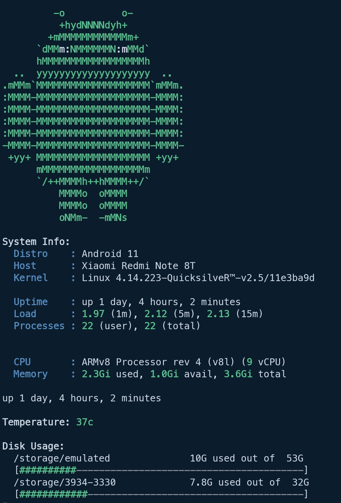
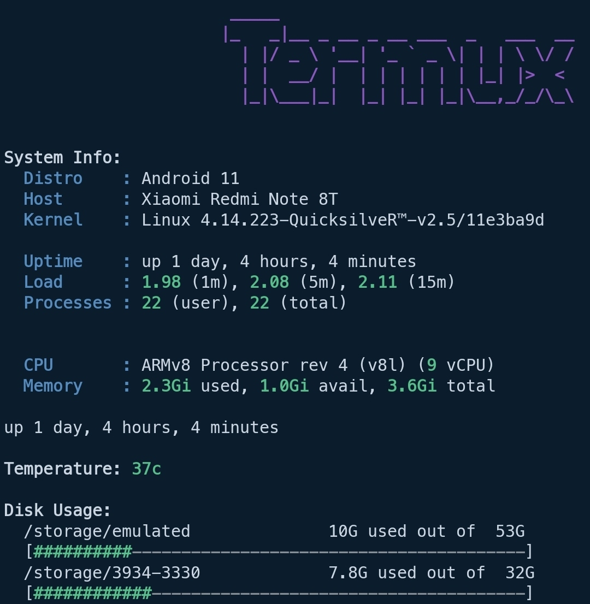
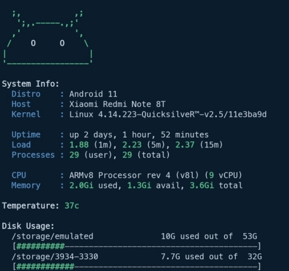

# Message of the Day

Collection of 'Message of the Day' scripts for [Termux](https://termux.com/).

More Screenshots

### Requirements

* figlet (termux-banner)

## Install
    wget -qO- https://git.io/Jm5hb | bash

**Manually**

    git clone https://github.com/Generator/termux-motd.git ~/.motd
    echo "$HOME/.motd/init.sh" >> ~/.profile # or .zprofile if using zsh

## Configure

**Disable Module:** Disable modules adding ``.disabled`` to the end of file. (e.g. ``10-android-logo-small.disabled``)
**Enable Module:** Remove ``.disabled`` from filename to enable module.

## Credits

* [yboetz/motd](https://github.com/yboetz/motd) (Orignal work)
